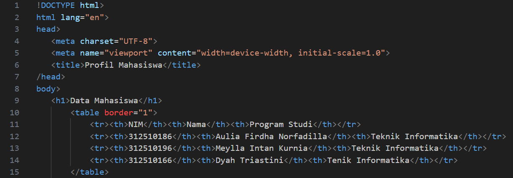
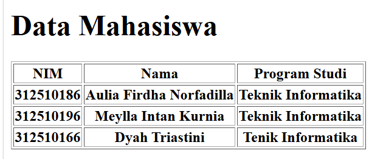
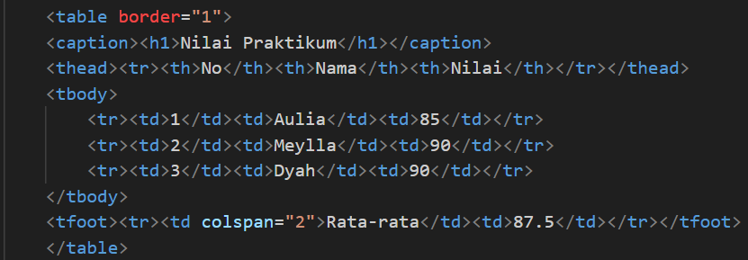
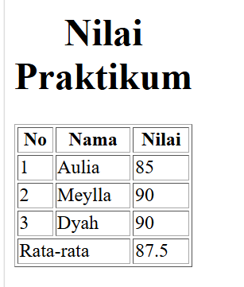
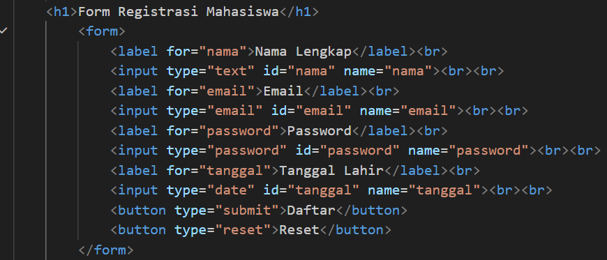
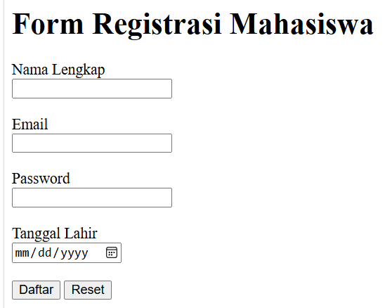

# Lab2Web
# 1. Data Mahasiswa

<table border="1">
            <tr>
                <th>NIM</th>
                <th>Nama</th>
                <th>Program Studi</th>
            </tr>
            <tr>
                <td>312510186</td>
                <td>Aulia</td>
                <td>Teknik Informatika</td>
            </tr>
            <tr>
                <td>312510196</td>
                <td>Meylla</td>
                <td>Teknik Informatika</td>
            </tr>
            <tr>
                <td>312510166</td>
                <td>Dyah</td>
                <td>Teknik Informatika</td>
            </tr>       
</table>

### Membuat tabel data (tidak bisa diubah)
Membuat tabel data mahasiswa (tidak bisa diubah)

Berikut, Outputnya :

# 2. Nilai Praktikum
<table border="2">
            <tr>
                <td>No</td>
                <td>Nama</td>
                <td>Nilai</td>
            </tr>
            <tr>
                <td>1</td>
                <td>Aulia</td>
                <td>85</td>
            </tr>
             <tr>
                <td>2</td>
                <td>Meylla</td>
                <td>90</td>
            </tr>
             <tr>
                <td>3</td>
                <td>Dyah</td>
                <td>95</td>
            </tr>      
</table>

### Membuat tabel nilai mahasiswa (sel & baris)
Nilai praktikum :

Berikut, outputnya :

# 3. Form Biodata
Membuat form registrasi 

Berikut, outputnya :

### Fitur Form Biodata
- Nama
- Email
- Program Studi
- Alamat
- Tombol Simpan
- Tombol Reset

## Multimedia
Project ini juga menggunakan
- Audio
[Klik disini untuk mendengarkan audio](music.mp3)
        <h3>Audio</h3>
                <audio controls>
                    <source src="music.mp3" type="audio/mpeg">
                    Browser Anda tidak mendukung elemen video.
                </audio>
- Video
[Klik disini untuk melihat video](videoo.mp4)
        <h3>Video</h3>
                <video controls width="480">
                    <source src="videoo.mp4" type="video/mp4">
                    Browser Anda tidak mendukung elemen video.
        </video>

## Tampilan
File utama yang digunakan adalah 'index.html'

## Cara Menjalankan
Buka file 'index.html' menggunakan browser

